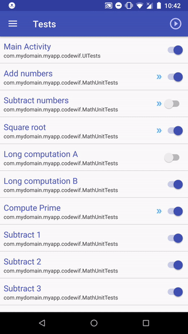
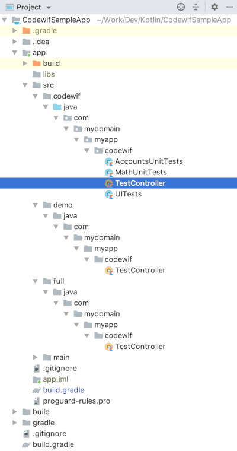
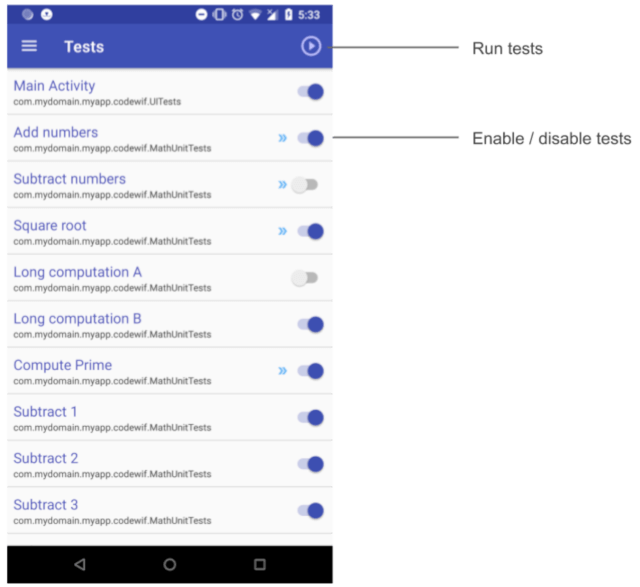
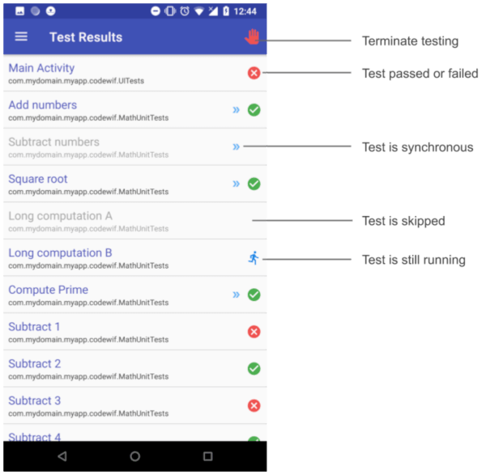
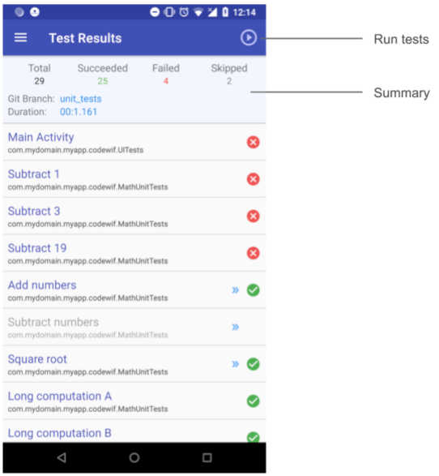
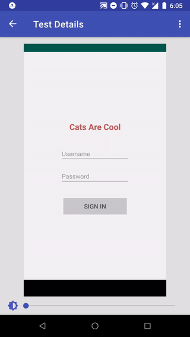

[](https://jitpack.io/#johannblake/codewif)

**This is currently under development and should be done by the end of the week.**

# Overview
Codewif is an Android library framework to allow you to perform in-app testing of Android apps and libraries. It offers the following benefits over the traditional way of testing apps:

✓ No need for JUnit, Espresso, UI Automator, instrumentation testing, Mokito, Robolectric...<br>
✓ UIs are tested by taking screen snapshots and comparing them to previous snapshots.<br>
✓ Execute multiple tests asynchronously, run them synchronously or use a mixture.<br>
✓ Eliminates the need for dependency injection. Say goodbye to Dagger and Koin.<br>
✓ Test code is integrated into your app through build variants and excluded during release builds.<br>
✓ Mocked classes and functions are done on separate git branches.<br>
✓ Integrates into your Continuous Integration (CI) server to report test results.<br>
✓ Extremely fast testing.<br>
✓ The Codewif framework is built with Kotlin and makes extensive use of coroutines.<br>
✓ Non-developers (testers) can run tests without needing Android Studio.<br>
✓ Easy to use.
<br><br>

# Table of Contents

* [In-App Testing](#in-app-testing)
* [UI Testing With Screenshot Comparisons](#ui-testing-with-screenshot-comparisons)
* [The Elimination of Dependency Injection](#the-elimination-of-dependency-injection)
* [Codewif Components](#codewif-components)
  * [Codewif Framework Library](#codewif-framework-library)
  * [Codewif Service App](#codewif-service-app)
* [Setting Up Your Test Environment](#setting-up-your-test-environment)
  * [Modifying Your Gradle Files](#1-modifying-your-gradle-files)
  * [Creating Folders For Test Code](#2-creating-folders-for-test-code)
  * [Creating a Stub File](#3-creating-a-stub-file)
  * [Launching Codewif](#4-launching-codewif)
  * [Setting Up Tests](#5-setting-up-tests)
    * [UI Tests](#ui-tests)
    * [Handling Test Exceptions](#handling-test-exceptions)
    * [Managing a Large Number of Tests](#managing-a-large-number-of-tests)
    * [Configuring a TestController](#configuring-a-testController)
    * [Testing an Android Library](#testing-an-android-library)
* [Using the Codewif UI](#using-the-codewif-ui)
  * [The Tests Screen](#the-tests-screen)
  * [The Test Results Screen During Testing](#the-test-results-screen-during-testing)
  * [The Test Results Screen After Testing](#the-test-results-screen-after-testing)
  * [Viewing a Failed UI Test](#viewing-a-failed-ui-test)
* [The Codewif API](codewif_api_docs.md)
* [Contributing](#contributing)
* [License](#license)

### In-App Testing
The most fundamental change that Codewif brings to developers is integrating test code into your app during testing phases. Instead of test modules residing in folders such as androidTest or unit tests residing in the Java test folder, your test code is part of your app's runtime code. Your test code is kept separate from your production code by means of Android's build variants.

The general flow of developing and testing an app using Codewif works as follows:

1. You code a feature in your app.
2. You create either a unit test or a UI unit test using Codewif's framework library.
3. To run your test, you select your build variant that is setup for testing and run your app.
4. When your app starts, you can either run the tests manually from Codewif's built-in UI or have them executed automatically.
5. When testing has completed, you can view the results in Codewif's UI, view them in Android's Log or have them automatically sent to Codewif's backend where you can view them as a report, or have the test results sent to your CI server.
<br><br>

### UI Testing With Screenshot Comparisons
One of the reasons why a lot of developers hate writing test code is due to the amount of code that needs to be written to test whether a user interface is displaying its content as expected. Android's Espresso framework, used for the so-called *instrumentation testing*, has a learning curve but is also slow.

Codewif takes a completely different approach to UI testing. It treats a UI similar to the way git treats code changes. Just as in git, changes to code are detected by comparing hashcodes of previous code versions to their current version, Codewif generates a hashcode of your app's entire screen image and compares it to a previous hashcode of the screen. If the hashcodes are not the same, the screens are considered different. The main benefit behind this approach is that it is incredibly fast and provides an actual visual presentation of the previous snapshot compared to the current snapshot allowing you to manually compare the two to see where the differences are. If even so much as a single pixel doesn't match up between the two snapshots, the test fails. Sometimes the change may be very obvious, such as changing a text size or color or repositioning an element. Other times it may be less obvious such as adding a bit more padding or changing a color only ever slightly. When a UI test in Codewif fails, after you inspect and compare the previous snapshot to the current one, you can decide whether the changes from the previous snapshot are valid and decide whether you would like to make the current snapshot your "good" or "expected" result for future testing.

In the current version of Codewif, snapshot images are stored on the device being tested. But a backend service is currently being developed that will allow you to store these snapshot images in the cloud. This of course is optional. You will have the option of storing the snapshot image along with its hashcode on Codewif's backend, choose to store only the hashcode, or store nothing. Once a snapshot and its hashcode is stored on the backend, other developers who want to run the tests on their own devices can easily detect any changes that occur due to any code changes that they may have made in their production code. In this sense, Codewif acts like an extension to git by providing a UI version control to let developers know when their locally tested UI doesn't match up with the version stored on the backend. But to use this, you must at the very minimum allow the hashcode for the UI to be stored on the backend. If you do choose to store only the hashcode and a UI test fails, you will have to investigate further to determine what the actual differences are between the previous and curent snapshots as you would not have any access to the previous snapshots.

Codewif's backend also tracks physical parameters of your device's screen in oder to properly cache the snapshot. For instance, the number of pixels for the screen's width and height as well as the dpi of the device are recorded. This allows you to run the same UI tests on diverse devices that have the same properties and generate a single snapshot image for all of them. If two devices do not share the same properties, a separate snapshot is stored for each.
<br><br>

### The Elimination of Dependency Injection
Unless you have a very compelling reason to use dependency injection (DI), you should avoid using it. DI, and Dagger in particular, overly complicates your code, is prone to adding unnecessary bugs and provides little and in most cases no benefit to most apps.

If you are using DI primarily to mock out classes and functions, you can achieve a simpler and cleaner solution by placing mocked classes on a separate test branch. When you checkout a test branch, you merge your development branch into your test branch and replace code in those classes that you want to mock out with your mocked code. You never merge from a test branch back into a development branch. Merging is only done in one direction - from development to testing.

In the event that you have merge conflicts, you will hae to manually fix these conflicts.

Even if your app already uses Dagger or Koin, you can still keep it and mock out any modules you want. But if you are just starting on a new app and have no compelling reason to use DI, then you instantiate all your objects in your classes as you normally would. There is no need to pass in an instantiated class through a constructor parameter unless you have a reason to do so.

If you are an organisation that uses Dagger or Koin extensively but almost never writes test code, you should seriously consider how much more valuable it is if you eliminate it and instead invest that same amount of time writing test code using Codewif. The benefits should not be underestimated. In a large application where little or no test code exists, changes by one developer to the codebase can have bad side effects on other portions of code and you would not notice this unless the app was thoroughly tested manually.

Using git branches for mocking isn't something specific or unique to Codewif. You can do this even with standard testing. But since Codewif makes use of build variants, using a build variant for a specific git branch can help produce highly streamlined testing scenarios.
<br><br>

# Codewif Components
Codewif for Android consists of two separate components: The **Codewif Framework Library** and the **Codewif Service App**

If you are doing any UI testing or you want to send test results to the backend, you need the Codewif Service App which must be installed on to the device being
tested.

### Codewif Framework Library
This is an Android library (AAR). It is used to setup and run tests. The library also contains a UI component that by default is shown when tests are run. It allows you to see all the tests that are defined, view the test results and compare snapshot images for UI tests. It also has functionality to let you send the test results to Codewif's backend or to your own backend server. You can also selectively run tests and exclude tests. Each test that you define can be run synchronously or asynchronously. When a test runs synchronously, it blocks all other tests following it until it completes. An asynchronous test on the other hand is non-blocking. UI tests are always run synchronously. In many cases, it is a time saver to run non-UI tests (so-called *"unit tests"*) asynchronously. But there are many cases even with unit tests where one test is dependent on being carried out before another one begins.

The following animation shows Codewif's UI running a bunch of tests. The first test is a UI test of the main activity. First the list of tests are shown. Testing is started manually by clicking on the ```Run``` button. The main activity is then shown briefly and then the test results screen is shown. The test on the main activity shows that it failed. When you click on it, you are taken to the test result details where you see a snapshot of the current activity, which in this demo is a login screen. You can then scroll to the bottom and then use the slider to make the previous snapshot gradually fade in. As it fades in, the previous snapshot is overlayed on top of the previous snapshot to make it easier to see where any difference are:


<br><br>

### Codewif Service App
The Codewif Service app is an Android app that the framework library interacts with. It provides the following functionality:

* Store a screenshot and its hashcode and return these to the framework library when testing is carried out.
* Communicates with the backend servers to send test results

The current version of the Codewif Service app stores screen snapshots to the device's SD card but as was previously mentioned, as soon as Codewif's backend service is available, screenshots can be stored there in order to allow better collaboration among testers as well as the use of diverse testing devices.

Snapshot images are stored on a device's SD card under the folder:

```/sdcard/Codewif/[project_id]/snapshots/```

where project_id is the id you assign to your project during the test setup. Because this is stored on the sd card, the files remain there even if you uninstall the Codewif Service app. Also, deleting the Codewif Service app's cache does not delete these files. The reason why these files are stored on the sd card is because the framework library also stores its screen snapshots there before handing them over the Codewif Service app. The sd card acts as a mutual storage place for both the framework library and the service app, avoiding the need to transfer large amounts of image data between the two. Should you find a need to reinstall the service app, you might want to delete all the data under ```/sdcard/Codewif``` to be sure you have a clean install.

By handling the storage of images and communicating with the backend, the service app can persist your test data even when your app is terminated or uninstalled.
<br>

# Setting Up Your Test Environment
Setting up your test environment to use Codewif consists of the following steps:

1. Modifying your gradle files
2. Creating folders for test code.
3. Creating a stub file in other build variants to mock out the code that launches Codewif.
4. Launching Codewif.
5. Setting up tests.
<br><br>

The instructions that follow assume that you want to test an Android app. If however you have an Android library that you want to test, the instructions are the same except that you will need to add an activity module to your project that is used to launch Codewif. In this case, the instructions below apply to your activity module and not to your library module.

### 1. Modifying Your Gradle Files
For detailed information on creating build variants for Android, see:

https://developer.android.com/studio/build/build-variants


The Codewif Framework Library is hosted on Jitpack's maven repository, so in your root build.gradle file, you need to add the following:

```gradle
allprojects {
    repositories {
        ...
        maven { url 'https://jitpack.io' }
    }
}
```

If your build.gradle file already has a maven reference to some other repository, you can add another one. Each repository must be listed inside its own curly
braces. Example:

```gradle
allprojects {
    repositories {
        maven { url 'https://some_maven_repo.com' }
        maven { url 'https://jitpack.io' }
    }
}
```
<br>

You need to modify your app's build.gradle file to setup a flavor for testing. (Note: If you are testing a library, you make these changes to the build.gradle file that is associated with the activity module that you use to test your library).

The following build.gradle file illustrates a build variant for testing using a flavor called ```codewif```:

```groovy
apply plugin: 'com.android.application'
apply plugin: 'kotlin-android'
apply plugin: 'kotlin-android-extensions'

android {
    compileSdkVersion 29
    defaultConfig {
        applicationId "com.codewif.sample.app"
        minSdkVersion 19
        targetSdkVersion 29
        versionCode 1
        versionName "1.0"
    }
    buildTypes {
        release {
            minifyEnabled false
            proguardFiles getDefaultProguardFile('proguard-android-optimize.txt'), 'proguard-rules.pro'
        }
    }

    compileOptions {
        sourceCompatibility JavaVersion.VERSION_1_8
        targetCompatibility JavaVersion.VERSION_1_8
    }

    flavorDimensions "version"

    productFlavors {
        demo {
            dimension "version"
            applicationIdSuffix ".demo"
            versionNameSuffix "-demo"
        }
        full {
            dimension "version"
            applicationIdSuffix ".full"
            versionNameSuffix "-full"
        }
        codewif {
            dimension "version"
        }
    }
}

dependencies {
    implementation fileTree(dir: 'libs', include: ['*.jar'])
    implementation"org.jetbrains.kotlin:kotlin-stdlib-jdk7:$kotlin_version"
    implementation 'org.jetbrains.kotlinx:kotlinx-coroutines-android:1.3.2'
    implementation 'androidx.appcompat:appcompat:1.1.0'
    implementation 'androidx.core:core-ktx:1.1.0'
    implementation 'androidx.constraintlayout:constraintlayout:1.1.3'
    codewifImplementation 'com.codewif:codewif:1.+'
}
```
Do not give your variant a name that starts with ```test``` as that is reserved by Android for its own testing purposes.

The entry for the Codewif dependency is created by taking the flavor name that you created for testing (here ```codewif```) and appending the word ```Implementation``` after it. When you create a dependency using the flavor name, the dependency is only included in your build when the build variant is selected. This is necessary to avoid the release version of your app from including Codewif.

If your app is currently not using coroutines, make sure to add the dependency:

```groovy
implementation 'org.jetbrains.kotlinx:kotlinx-coroutines-android:1.3.2'
```

Codewif also depends on Java 1.8, so make sure you have the following:

```groovy
sourceCompatibility JavaVersion.VERSION_1_8
targetCompatibility JavaVersion.VERSION_1_8
```
<br>

### 2. Creating Folders For Test Code
After you have modified your build.gradle file to create a flavor for testing, you can create the folders that will be used to contain your test code. While you can create these folders manually, it is safer if you use Android Studio's assistant to create them for you. To launch the assistant, in the project pane, right click on the app module, and select ```New > Folder > Java Folder```. From the dialog, select the flavor from the *Target Source Set* where you want the folder to be created. Select the flavor that corresponds to the test flavor you created in build.gradle and then press Finish.

If your project wasn't using flavors, you need to create at least one more additional flavor. This is needed because when you select a build variant to build with, Android Studio combines all the code in your ```main``` folder with all the code in the folder that corresponds to your selected build variant. Later we will show how to launch Codewif from your activity. But when you want to build a variant of your app that is not the test variant, the code that launches Codewif needs to be swapped out with a stub file. In order for that to work, the stub file cannot be part of your ```main``` folder. It must reside in all of the folders that correspond to the other build variants. In this example app, we have three build variants: ```demo```, ```full``` and ```codewif```

The folders for these three variants looks like this:



The class used to launch the tests is called ```TestController```. The version under the codewif variant is the one that will launch Codewif, while the ones under ```demo``` and ```full``` are only stub files.
<br><br>

### 3. Creating a Stub File
Although you can name and place the stub file anywhere in your project where it makes sense, it is recommended that you call it ```TestController``` and place it in a package called ```codewif```. If all developers do this, it will promote consistency. This is what your stub file should look like:

**TestController.kt**

```kotlin
/**
 * This is a stub file for testing the app with Codewif.
 */
object TestController {
    fun runTests(context: Context) {
        // No further code is added here.
    }
}
```
<br>

### 4. Launching Codewif
How you launch your testing depends on whether you want to run your tests manually and interact with Codewif's UI or whether you want to launch your tests immediately without any user interaction. In your stub file, the function you use to launch testing is left empty. But on the test branch, it is replaced with your test code.
 
**Start Testing Manually:** Use a click event handler to launch Codewif. For instance, you could have a textview somewhere and add a click event handler to it which then launches Codewif.

**Start Testing Automatically**: Place this inside your main activity's ```onCreate``` method. You should do this after your app has already been initialized. This might mean having to test to see if all your app's setup conditions have been met before launching Codewif. In many cases, you can just simply place a call to your launch method as the last thing in your ```onCreate``` method. In other cases where it takes several seconds before your app completes a stable startup, you may find it easier to just use a delay in your launch code.

The following code shows how to launch Codewif:

```kotlin
class MainActivity : AppCompatActivity() {

    override fun onCreate(savedInstanceState: Bundle?) {
        super.onCreate(savedInstanceState)
        setContentView(R.layout.activity_main)

        // Start testing automatically
        TestController.runTests(this)

        // Alternatively, start testing by clicking on some label.
        textview_title.setOnClickListener {
            TestController.runTests(this)
        }
    }
}
```
<br>

### 5. Setting Up Tests
Although there is no fixed rule on where you place your test code, it is recommended that you place it in the same folder where your TestController class is located. You should however organize your tests in a way that makes sense. One strategy is to separate unit testing from UI testing, so a folder called ```unitTesting``` and another one called ```uiTesting``` would be good choices.

You should also separate your tests by related groups. For example, if you are doing unit testing and have utility classes for strings, dates, math, etc., you should create separate test classes for each of these. 
 
Create a test class that inherits from ```TestSetup```. Here is an example of a test class that performs unit tests on math utility functions:

```kotlin
import com.codewif.framework.models.TestResult
import com.codewif.framework.models.UnitTest
import com.codewif.framework.testing.TestSetup

/**
* This is where tests are configured.
*/
class MathUnitTests : TestSetup() {
    init {
        addTest(UnitTest("Number is divisible by 4").testToRunSync {
            val testResult = TestResult()
            testResult.succeeded = MathUtis.divisibleByFour(18)
            testResult
        })
        
        addTest(UnitTest("Is a prime number").testToRunAsync { callback ->
            val testResult = TestResult()
            testResult.succeeded = MathUtils.isPrime(181)
            callback.invoke(testResult)
        })
        
        addTest(UnitTest(testName = "Position in PI is even", skipTest = true).testToRunAsync { callback ->
            val testResult = TestResult()
            testResult.details = "The maximum value allowed is 1000000"
            testResult.succeeded = MathUtils.positionInPIIsEven(43986)
            callback.invoke(testResult)
        })

        addTest(UnitTest("Number is a Fibonacci sequence").testToRunAsync { callback ->
            val testResult = TestResult()
            testResult.succeeded = MathUtils.isAFibonacciNumber(46368)
            callback.invoke(testResult)
        })
    }
}
```
<br>

Each test is added using the addTest method which takes a UnitTest object. The UnitTest object's constructor takes a ```name``` parameter that you use to provide a human readable text to identify your test. The text you provide can only be used once per package name. You cannot have the same test name appear more than once in the same package. You can however re-use the name if the package name for the class combined with the class name is different. Internally, Codewif generates a unique id based on the package name + class name + test name. The order in which you add tests is the order in which they are executed.

If you have a test that takes a long time to run and only want to start the test manually by clicking on it in Codewif's UI, you can set the skipTest parameter to true, as is shown for the "**Position in PI is even**" test.

You must also decide how you want to run a test. You can run it either synchronously or asynchronously. If a certain test requires that the app is in some state before the test can be carried out and other tests are run prior to reaching that state, you should set those prior tests to run synchronously. For example, if your app needs to retrieve data from a backend and test that it meets some condition before performing any further tests with the data, you would run your data retrieval test synchronously.

You use the ```testToRunSync``` method if you want to run the test synchronously and use the ```testToRunAsync``` if you want it to run asynchronously.

When you run an asynchronous test, your test is provided with a callback parameter. Your test must call the callback by executing the ```invoke``` method as shown in the example above.
<br><br>

#### UI Tests
This is a class to perform a single UI test on the main activity:

```kotlin
class MathUnitTests : TestSetup() {
    init {
        addTest(UnitTest("Main Activity").uiTestToRun {
            // Write code here to navigate your app to the screen you want to test.
            // Add an optional delay to allow the app to complete its loading state.
            delay(200)
        })
    }
}
```
<br>

To create a UI test, use the ```uiTestToRun``` method. In your test implementation, you write whatever code is necessary to navigate to the screen you want to test. You may also need to add code that does things like scrolling your screen to some position, enabling or disabling checkboxes, entering text into EditText fields and so on. In many cases, just adding a delay for a few hundred milliseconds will suffice to allow the activity to complete its initialization.

Once you have the screen in the state you want to have it tested in, you simply return. Upon returning, Codewif will automatically take a screenshot of your app's screen and then compare it with the previous snapshot (if one exists). If no previous snapshot of the screen exists for the test, the test will be considered to have passed.

It should be noted that a screen snapshot does not include Android's status bar at the top of the screen (where notifications are shown as well as the clock and battery status). Even if this were possible to include this in the snapshot, your test would always fail because some of the things on the status bar change over time including the clock and battery level.

If the UI that you are testing contains any kind of animation, you will not be able to test it as it would be highly unlikely that you could get the exact same snapshot each time. In addition to animations, you need to take care of elements like the EditText field where a cursor can flash when the input field has focus. The test will usually fail because there is no guarantee that the flashing cursor will be visible or not visible at the moment that snapshot is taken. To get around this, it is suggested that you either prevent the field from having focus when the screen is shown. You can either do this permanently in your production code, or add some code in your test to temporarily remove the focus. The easiest way to remove focus from an EditText field when an activity is shown is to set focusableInTouchMode to true in the EditText's parent container. For example:


```kotlin
<?xml version="1.0" encoding="utf-8"?>
<androidx.constraintlayout.widget.ConstraintLayout
    android:layout_width="match_parent"
    android:layout_height="match_parent"
    android:focusableInTouchMode="true">

    <EditText
        android:id="@+id/et_username"
        android:layout_width="200dp"
        android:layout_height="wrap_content" />

</androidx.constraintlayout.widget.ConstraintLayout>
```

#### Handling Test Exceptions
If your test encounters an unhandled exception, Codewif will catch this and include the exception's ```message``` information in the ```details``` field, which is a property of the TestResult class. Even if your test succeeds, you can use the details property and put any text in it that you want. This text will show up in Codewif's UI when you view the test results for the test. It will also be included if you export your tests to JSON data or send it to the backend. You might want to use this feature in the event that you want to report internal data or state information to provide more context about a test. This might be useful by providing more context to others who might be running your tests.
<br><br>

#### Managing a Large Number of Tests
If you have a large project with a lot of tests, you might want to consider breaking up the tests into multiple files. If for example, you were testing a math utility class that had 100 methods, you might consider placing 50 of the tests in one file and the remaining in another. In some rare cases, you may need to do this. If you were running 100 tests on a device that had very little memory and your tests use up a lot of memory or other resources, the app may crash or be terminated by Android if it runs out of memory. Codewif is designed to let your test class be garbage collected as soon as the last test in the class has completed.
<br><br>

#### Configuring a TestController
Now that you have your test classes, you need to add them to your test controller class. In the TestController class you add references to your test classes using the ```addTestSetups``` method of the TestRunner object. Here is an example:

```kotlin
/**
 * This is where you configure the test runner.
 */
object TestController {
    fun runTests(context: Context) {

        val mainScope = MainScope()

        mainScope.launch {
            TestRunner
                .setAppContext(context)
                .setProjectId("Codewif Sample App")
                .setAppName()
                .setVersionName(com.codewif.sample.BuildConfig.VERSION_NAME)
                .setGitBranchName("unit_tests")
                .setOnTestingCompletedListener { succeeded ->
                    val jsonFailed = TestRunner.exportFailedTestsToJson()
                    // Do something with the JSON data.
                }
                .sendTestResultsToBackend(url = "https://hookb.in/dmPG11m3DBFGDEK1Ym7l")
                .displayTestResults()
                .showTestResultsAfterTesting()
                .addTestSetups(::MathUnitTests, ::StringUnitTests)
                .runTests()
        }
    }
}
```

The ```addTestSetups``` method takes one or more references to your test classes which inherit from ```TestSetup```. The order in which you add these is the order in which these tests will be executed. The ```addTestSetups``` should be the last method you call before calling ```runTests```. However, you are not required to call ```runTests```. If you plan on running the tests manually, leave out the ```runTests``` method. In this case, ```addTestSetups``` would be the last method you call.

It should be noted that while the example above uses a coroutine to launch the testing, you are not required to do this. However, it is recommended in order to allow your tests to be setup asynchronously while your app is starting. Even without this coroutine, the ```runTests``` method does in fact run your tests inside its own coroutine.
<br><br>

#### Testing an Android Library

The above TestController example is for testing an Android app. If the project you are testing is a library, you would not use the ```setAppName``` method but rather the ```setLibraryPackageName``` instead. So replace the ```setAppName``` in the code above with:

```kotlin
setLibraryPackageName([package_name_of_library].BuildConfig.LIBRARY_PACKAGE_NAME)
```

> NOTE: For the setLibraryPackageName and setVersionName methods, prefix the BuildConfig with the package name of your library. If you leave this out, BuildConfig may inadvertently refer to the package of the module used to launch the activity and the code below will not compile because LIBRARY_PACKAGE_NAME can only be referenced from a library module. See the sample app for testing a library for an example.


In order to test an Android library, you need to have an activity module in your project that is used to launch Codewif. You setup the activity module the same way as was described previously for testing an Android app. You then configure a debug configuration in Android Studio to launch your test activity. It is recommended that after calling runTests to start testing, you close your test activity with ```finish```, as there is really no need for this activity other than to launch Codewif.
<br><br>

---
<br>
At this point, you have completed setting up your test and can run your app. Just make sure that you have selected the  build variant for testing before running your app. It is very easy to overlook this and wonder why no in-app testing is available when you go to run the app.
<br><br>

# Using the Codewif UI

### The Tests Screen
The tests screen lists all the tests that have been defined:



The tests are listed in the order in which they will be run. You can enable or disable a test. If a test is disabled, it will not be executed when you run the tests. You can also disable (skip) a test programmatically. This is useful in cases where you have a test that may take a long time to complete and you only want to execute it manually.

You Run button on the toolbar at the top is used to run all the tests. When you click on this, the screen switches to the Test Results screen, although it may be hidden during testing if you have configured your testing to do so.

You can also run any test by clicking on it.
<br><br>

### The Test Results Screen During Testing
The test results screen while testing is in progress:


<br><br>

### The Test Results Screen After Testing
The test results screen when testing has completed:



A summary is shown of the total tests defined, the total successes, the total failures and the total tests that were skipped. The git branch name is shown to indicate the branch that was used to compile and run the tests. The duration indicates how long it took to run all the tests. If you want, you can run the tests again by clicking on the ```Run``` button in the top right corner.

When testing starts, the tests are listed in the order in which they will be executed. But if a test fails, it is moved to the top of the list. The first test that fails is always the first item in the list followed by the next test that fails and so on. Testing is always in progress if the ```Stop``` button (the hand icon) is visible.

You can also configure your TestController so that testing terminates whenever the first test fails. By default, all tests are executed, even when one fails.
<br><br>

### Viewing a Failed UI Test
The following animated gif shows a UI test that failed. If you click on the test and scroll to the bottom of the screen, you can slide the slider to the far right and the previous image of the UI will appear over top the current snapshot. You can easily see in this example that the title text and its color has changed as well as the padding on the button:



If the current snapshot is correct and you want it to replace the previous one, click on the options menu in the top right corner on the status bar and select ```Update snapshot image```.
<br><br>

# The Codewif API

For detailed information on the classes and methods provided by Codewif's library framework, see: 
[The Codewif API](codewif_api_docs.md) documentation.
<br>


# Contributing
Contributions by developers are welcomed. A few rules however need to be observed:

* Features must provide enhanced testing that most developers will find useful.
* Do not use dependency injection in your code (that should go without saying).
* Avoid the use of rxJava. Not all developers feel a need to learn a complex library. If you need to implement reactive code, consider using Kotlin's Flow.

# License
This software is open source and licensed under the GNU GENERAL PUBLIC LICENSE (Version 3). See:

http://www.gnu.org/licenses/gpl-3.0.html

